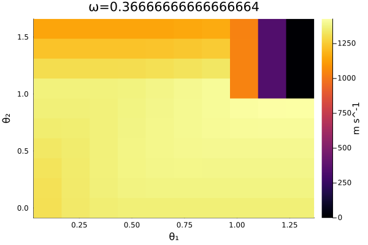

# AscentOptimization.jl

This Project is my attempt to use machine learning to optimize ascent trajectories in kerbal space program
Essentially it is supposed to get into orbit using less delta-V then I could have done by hand. 

## Todo

 - [X] write a basic physics simulation 
 - [X] build a model that dictates how the ship will ascend
 	- [ ] improve the circularizing maneuver
 - [X] train the model using reinforcement learning
 - [X] train the model using gradient descent
 - [X] make simulation and training handle unitful quantities
 - [ ] model the atmosphere in the simulation
 - [ ] use actual parameters from Kerbal Space program
 	- [ ] validate on an atmosphere-less body like the mun
 - [ ] write the kos code to control the ship during ascent
 

## How this project is organized.

This project is roughly organized into two parts

1. A library of miscellaneous code that includes all the physics and machine learning stuff I need

2. A set of notebooks that I use to visually inspect and prototype the code

Eventually a third part will be added which uses the trained model to controll a ship in kerbal space program.

## Methodology (WIP)

The model dictates the angle of the (negative) thrust vector from the vertical at a given point in time.
It does this by storing a vector of angles and a rate, which it uses a cubic spline to turn into a function from time to angle. 
The length of this vector can vary, allowing for more or less complicated models. 

The model is evaluated by running a simulation of a ship going into orbit in three stages, then calculating the Delta V of the ship once it's in orbit

These stages are 

1. Ascent: the ship burns until the apoapsis is above some target altitude (plus some margin). 
2. Coast: the ship cuts the engines and waits until it is at or above the target altitude.
3. Circularize: the ship burns at 90\degree from the vertical until the periapsis is at or above the target altitude

The model controls the direction of the thrust during the ascent stage.

### Reward function
The reward function is defined as the delta-V if the final periapsis of the rocket is above the target altitude, and `0m/s` otherwise. 

```julia
const RewardType = typeof(0.0m/s)
function reward(model::Model, body, target_altitude)::RewardType
	(ship, _) = runModel(model)
	return delta_v(ship)*(target_altitude < periapsis(ship,body))
end
```
This was chosen because it is simple while also capturing what we want. Note that this reward function favors circular orbits, as they require the least 
delta V for an orbit given periapsis.
The hard cut-off for ships which don't get a high enough periapsis could be a problem in theory, but in practise it doesn't seem too bad.



### Reinforcement Learning

The method used here was inspired by (read plagerized from) <https://rl-book.com/>. 
This code treats the problem of finding the optimal ascent trajectory like a game, where the moves are 

$$ \omega -> \omega\pm\Delta\omega $$

$$\theta\_0 -> \theta_0\pm\Delta\theta $$

$$\vdots$$

$$\theta\_n -> \theta_n\pm\Delta\theta $$

where $\omega$ and $\theta\_0..\theta\_n$ are the angular rate and angles used in the model, and $\Delta\omega$ and $\Delta\theta$ 
are changes small enough that the model converges to the optimal solution, but big enough that it does so in a reasonable amount of time. 

The code learns to play this game by storing an estimate of how good each move is (i.e. the "quality") and using an $\varepsilon$-greedy algorithem to 
decide beween trying different moves, or reapplying the same move. After each move the reward is calculated and and the quality of that move is updated

Because problem is pretty non-stationary (e.g. incrementing $\theta_n$ once may make the tragectory better, doing so twice might overshoot and make it 
worse), the quality is updated with a constant learning rate, in order to bias the estimation to later moves. 

This approach innitially showed some good performance. However but the fact that it was highly stochastic means that it's difficult to get consistant 
performance, especially when trying to find good values of the two training parameters (actually 4, but so far I've neglected $\Delta\omega$ and 
$\Delta\theta$).


### Gradient Descent. 

I decieded to use gradient descent when looking at the path of an ascent trajectory through the "reward space", and thinking "why can't I just nudge it 
that way?". Because the reward function is a physics simulation (and therefore it *probably* doesn't have an analytical solution) automatic differentiation
doesn't work. So instead I used a finite difference method with a `relstep` tweaked until the gradient direction made sense. 

This method is slower than some of the reinforcment learning runs, but as long as the code can deal with singularities (which I do by just backtracking 
whenever the change in reward becomes negative), it can consistantly match performance with the best reinforcement learning runs.

## Real time control. (WIP)
My plan is to use the KOS (kerbal operating system) mod to control the ship using a machine learning model. I haven't decided if I want to have it send 
telemetry over telnet to a julia script, which sends commands back to the ship, or if I want to try to run the model in kos.

Ultimatly, is the round-trip lag small enough that I don't have to write cubic spline interpolation in what is essentially kerbal-basic.

## Results (WIP)

### Small Panet, No atmosphere

### Realiztically sized planet, No Atmosphere

### Kerbin, from Kerbal space program

### Kerbin, but actually, in game

